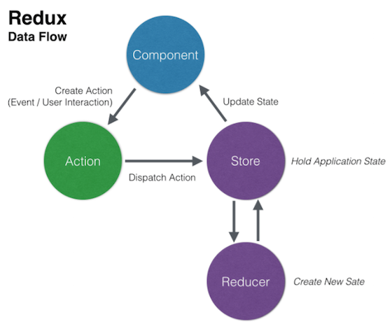
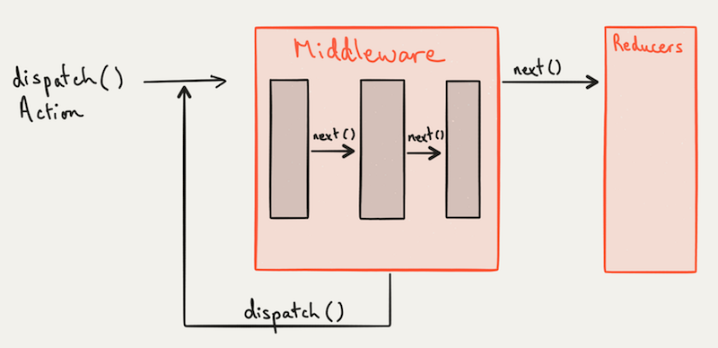

# Redux


> Redux is a predictable state container for JavaScript apps.
https://redux.js.org

## Installation

```bash
yarn add redux
```

## Motivation

- Managing an app state that changes a lot is hard (especially in frontend).
- How to keep control over the "when?", "why?", and "how?" of the app state?
- How to make state mutations predictable?

## Concepts

1. The whole state of your app is stored in an object tree inside **a single store**.
2. The only way to change the state tree is **to emit an action**, an object describing what happened.
3. To specify how the actions transform the state tree, you write **reducers** (pure functions).



**Benefits:**

- Apps more predictable (single source of truth, unidirectional data flow).
- Traceability of every state mutations -> undo/redo is trivial (aka "time travel debugging").
- The state can be easily persisted and restored (from server or any storage).
- It's easier to debug/inspect a single state tree.
- Apps scale really nicely :)

### Store

It's an object that holds the whole state of your app.

```javascript
const { createStore } = require('redux');

// TODO: define a reducer

// API -> { getState(), subscribe(), dispatch() } - see next example
const store = createStore(reducer);

// accessing the state
store.getState();
```

### Actions

- Dispatching actions is **the only way** to mutate the internal state.
- Each action is an **object with a type** that describes what happened.

```javascript
const { createStore } = require('redux');

// TODO: define a reducer

// API -> { getState(), subscribe(), dispatch() }
const store = createStore(reducer);

// registering a mutation listener
const unsubscribe = store.subscribe(() => console.log(store.getState()))

// updating the state
store.dispatch({ type: 'LIKE' });
store.dispatch({ type: 'LIKE' });
store.dispatch({ type: 'DISLIKE' });
store.dispatch({ type: 'LIKE' });
```

### Reducers

- A reducer is a **pure function** that receives the actual state and the action as arguments.
- It decides how every action transforms the actual state into the next state.
- It should **never mutate the state** received, but should always return a brand new object if the state changes.

A pure function is a function that returns the exact same output for given inputs, it is also free of side-effects.

```javascript
const { createStore } = require('redux');

/*
  * @param {*} state Can be object, array or primitive
  * @param {Object} action
  * @param {String} action.type
  *
  * Remember Array.prototype.reduce((acc, value) => ...) ? ;)
*/
function reducer(state = { likes: 0, dislikes: 0 }, action) {
  switch (action.type) {
    case 'LIKE':
      return {
        ...state,
        likes: state.likes + 1,
      };

    case 'DISLIKE':
      return {
        ...state,
        dislikes: state.dislikes + 1,
      };

    default:
      return state;
  }
}

const store = createStore(reducer);

store.subscribe(() => console.log(store.getState()))

store.dispatch({ type: 'LIKE' });
store.dispatch({ type: 'LIKE' });
store.dispatch({ type: 'DISLIKE' });
store.dispatch({ type: 'LIKE' });
```

## Best practices

### Combining multiple reducers

As the app grows, it's good practice to split the root reducer into smaller reducers that operates independently on the different parts of the state tree and to combine them.

```javascript
const { createStore } = require('redux');

const reactionsReducer = (state = { likes: 0, dislikes: 0 }, action) => {
  switch (action.type) {
    case 'LIKE':
      return {
        ...state,
        likes: state.likes + 1,
      };

    case 'DISLIKE':
      return {
        ...state,
        dislikes: state.dislikes + 1,
      };

    default:
      return state;
  }
};

const commentsReducer = (state = [], action) => {
  switch (action.type) {
    case 'ADD_COMMENT':
      return [
        ...state,
        action.payload.text,
      ];

    default:
      return state;
  }
};

const reducer = (state = { reactions: { likes: 0, dislikes: 0 }, comments: [] }, action) => {
  return {
    reactions: reactionsReducer(state.reactions, action),
    comments: commentsReducer(state.comments, action),
  };
};

const store = createStore(reducer);

// ...
```

Redux provides the built-in function `combineReducers`:

```javascript
const { createStore, combineReducers } = require('redux');

const reactions = (state = { likes: 0, dislikes: 0 }, action) => {
  switch (action.type) {
    case 'LIKE':
      return {
        ...state,
        likes: state.likes + 1,
      };

    case 'DISLIKE':
      return {
        ...state,
        dislikes: state.dislikes + 1,
      };

    default:
      return state;
  }
};

const comments = (state = [], action) => {
  switch (action.type) {
    case 'ADD_COMMENT':
      return [
        ...state,
        action.payload.text,
      ];

    default:
      return state;
  }
};

const reducer = combineReducers({ reactions, comments });

const store = createStore(reducer);

// ...
```

### Using action creators

- An **action creator** is a (factory) function that creates an action.
- Calling an action creator only produces an action, it does not dispatch it.
- If an action creator needs to read the current state, to perform an API call, or to cause a side effect, it should return an **async action** (function) instead of an action (see next section).

#### Sync actions

```javascript
// ...

const COMMENT_ACTIONS = {
  ADD_COMMENT: Symbol('add comment'),
};

function addComment(text) {
  return {
    type: COMMENT_ACTIONS.ADD_COMMENT,
    payload: {
      text,
    },
  };
};

// ...

store.dispatch(addComment('Yey! So cool :D'));
store.dispatch(addComment('Im-pre-ssive!!!'));
```

#### Async actions

- `store.dispatch(...)` always sends **synchronously** an action to the store's reducer.
- It expects actions to be **plain objects** ready to be consumed by the reducer.

To dispatch **asynchronous actions** (like fetching data from an API), we can use the [Redux Thunk middleware](https://github.com/reduxjs/redux-thunk):

```bash
yarn add redux-thunk
```

```javascript
const { createStore, applyMiddleware } = require('redux');

// redux-thunk >= 2.x in CommonJS environment
const reduxThunkMiddleware = require('redux-thunk').default;

// ...

const store = createStore(
  reducer,
  applyMiddleware(reduxThunkMiddleware),
);

// ...
```

- By applying this middleware, an action creator can return a function instead of an action object.
- The action creator becomes a **thunk**, a function that wraps an expression to delay its evaluation.
- The action creator can be used to **delay the dispatch of an action**, or to dispatch only if a certain condition is met.

```javascript
const { createStore, applyMiddleware } = require('redux');

// redux-thunk >= 2.x in CommonJS environment
const reduxThunkMiddleware = require('redux-thunk').default;

// ...

const { addComment } = require('./comments');

// function executed by the Redux Thunk middleware
const addCommentAsync = (text) => {
  // the async action creator automatically receives dispatch() and getState()
  return (dispatch, getState) => {
    setTimeout(() => {
      // we can now dispatch actions asynchronously, based on the current state
      dispatch(addComment(text));
    }, 1000);
  };
};

const store = createStore(
  reducer,
  applyMiddleware(reduxThunkMiddleware),
);

// ...

store.dispatch(addCommentAsync('It gets really interesting!'));
store.dispatch(addComment('Yey! So cool :D'));
store.dispatch(addCommentAsync('Boom.'));
store.dispatch(addComment('Im-pre-ssive!!!'));
```

There is a rich ecosystem of middleware to deal with async actions: `redux-promise`, `redux-promise-middleware`, `redux-observable`, `redux-saga` (to build more complex asynchronous actions) or `redux-pack`.

You can even write a your own custom middleware... More below!

#### Why using actions creators?

1. **Basic abstraction** -> rather than writing action type strings in every component that needs to create the same type of action, put the logic for creating that action in one place.
2. **Documentation** -> the parameters of the function act as a guide for what data is needed to go into the action.
3. **Brevity and DRY** -> there could be some larger logic that goes into preparing the action object, rather than just immediately returning it.
4. **Encapsulation and consistency** -> consistently using action creators means that a component doesn't have to know any of the details of creating the action, and whether it's a simple "return the action object" function or a complex thunk function with numerous async calls.
5. **Testability and flexibility** -> if a component only ever calls a function passed to it rather than explicitly referencing `dispatch`, it becomes easy to write tests for the component that pass in a mock version of the function instead. It also enables reusing the component in another situation, or even with something other than Redux.

### Middleware

- Middleware provide **extension points** between dispatching an action and the moment it reaches the reducer.
- They form a pipeline around `dispatch` and can **modify / intercept / interact** with any action coming through that pipeline.



- They are **higher-order functions** that compose a `dispatch` function to return a new `dispatch` function.
- They are given references to the store's `dispatch` and `getState` methods.
- They are a place of choice for managing all the **side effects** (async behavior, ...).

**Some usages:**

- centralized actions logging
- centralizing analytics
- centralizing API requests
- throttling/debouncing actions
- ...

```javascript
// ...

const loggerMiddleware = ({ getState, dispatch }) => next => action => {
  console.log('DISPATCH "%s" ->', action.type, action);
  next(action);
};

const store = createStore(
  reducer,
  applyMiddleware(
    // Order IS important!
    reduxThunkMiddleware,
    loggerMiddleware,
    // ...
  ),
);

// ...
```

#### Action processing patterns

Actions can be divided in 3 categories:

1. **Event actions** -> notification that something is happening (app went offline, ...)
2. **Command actions** -> ask for something, start a process (fetch some data from an API, ...)
3. **Document actions** -> has the final structure of the data and is the only one that the reducer processes

### Higher order reducers or reducer enhancers

A **reducer enhancer** (or a **higher order reducer**) is a function that takes a reducer, and returns a new reducer that is able to handle new actions, or to hold more state, delegating control to the inner reducer for the actions it doesn't understand.

```javascript
function doNothingWith(reducer) {
  return function(state, action) {
    // Just call the passed reducer
    return reducer(state, action)
  }
}
```

`combineReducers()` is an example of reducer enhancer because it takes reducers and returns a new reducer:

```javascript
function combineReducers(reducers) {
  return function(state = {}, action) {
    return Object.keys(reducers).reduce((nextState, key) => {
      // Call every reducer with the part of the state it manages
      nextState[key] = reducers[key](state[key], action)
      return nextState
    }, {})
  }
}
```

**Some usages:**

- undo/redo/clear history
- ...

### React integration

;)

## Resources

- Redux amazing docs -> https://redux.js.org/introduction/getting-started
- Getting Started with Redux videos (courtesy of Dan Abramov himself) -> https://egghead.io/series/getting-started-with-redux
- Idiomatic Redux (series of really good blog posts from a Redux maintainer) -> https://blog.isquaredsoftware.com/series/idiomatic-redux/
- Practical Advanced Redux video (live coding demos of middleware) -> https://www.youtube.com/watch?v=Gjiu7Lgdg3s
- Advanced Redux: Design Patterns and Practices -> https://www.youtube.com/watch?v=5gl3cCB_26M
